# Architecture

This document describes how Colby Mainard's personal website is built and why it is built that way. It is a snapshot of the repository as of **2026-09-29** (`CACHE_VERSION` `v79` in `service-worker.js`).

- For the content overview, see [README.md](README.md).
- For edit-time rules, checklists, and hard "do not" rules, see [AGENTS.md](AGENTS.md) and [CLAUDE.md](CLAUDE.md).
- This file explains the *shape* of the system and the reasoning behind it. When it disagrees with the source files, the source wins, and this file should be corrected.

## Contents

1. [System overview](#1-system-overview)
2. [Architectural constraints](#2-architectural-constraints)
3. [Repository layout](#3-repository-layout)
4. [Pages and page anatomy](#4-pages-and-page-anatomy)
5. [Build and deployment](#5-build-and-deployment)
6. [Styling architecture](#6-styling-architecture)
7. [JavaScript architecture](#7-javascript-architecture)
8. [Paths, origins, and the 404 page](#8-paths-origins-and-the-404-page)
9. [SEO, structured data, and discovery](#9-seo-structured-data-and-discovery)
10. [Accessibility architecture](#10-accessibility-architecture)
11. [Content model and maintenance workflows](#11-content-model-and-maintenance-workflows)
12. [Supporting material in the repository](#12-supporting-material-in-the-repository)
13. [Known gaps and accepted tradeoffs](#13-known-gaps-and-accepted-tradeoffs)
14. [Decision record](#14-decision-record)

---

## 1. System overview

The site is a static, client-side-only website served by GitHub Pages at <https://colbymainard.github.io/>. It consists of seven HTML pages, one compiled stylesheet, sixteen classic JavaScript files, and a handful of root-level metadata files. There is no server, no backend, no database, no npm, and no bundler. The only runtime dependency is AnimeJS, loaded from a CDN.

It serves two audiences: potential colleagues and employers (competencies, skills, and held beliefs) and fellow technology enthusiasts (hobbies and technical resources). Because the site's job is to be found, read, and trusted rather than to run application logic, most of its architecture concerns **discoverability** (structured data, a feed, `llms.txt`), **accessibility**, and **robustness when scripts or the network fail**.

### System context

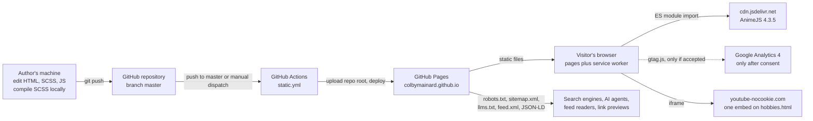

---

## 2. Architectural constraints

Every design decision in the repository traces back to one of these constraints.

| Constraint | What it forces in the code |
| --- | --- |
| **No server-side processing.** GitHub Pages serves files as-is. | No API routes, no secrets, no server-rendered templates. Every page is a complete hand-written HTML file. Analytics comes from a third-party script. |
| **Must work from both `file://` and `https://`.** | Every internal path is relative. A shared helper (`path_helpers.js`) computes the route back to the site root. Features that browsers block on `file://` (manifest fetch, service worker, analytics) switch themselves off there instead of erroring. |
| **Minimal dependencies.** | AnimeJS is the only external library, loaded through an `importmap` from jsDelivr. No package manager, no bundler, no transpiler. Scripts are plain ES5-style IIFEs that share state through a few named globals. Adding any dependency requires the owner's approval. |
| **Progressive enhancement.** | Every script-driven feature has a complete no-JavaScript state. Animations hide content only after a script opts in, the photo gallery falls back to a stacked list, "Copy link" buttons simply don't exist, and the current-page nav state is in the markup. |
| **Accessibility is a requirement, not a polish pass.** | WCAG AA contrast on every palette pair, reduced-motion and forced-colors support in shared mixins, `clamp()` headings for reflow, deliberate focus order for injected UI. |
| **Credible, professional presentation.** | Structured data on every page, one consolidated `Person` entity, a feed, and an LLM-facing summary so the site is represented accurately wherever it is indexed or summarized. |

---

## 3. Repository layout

```text
.
├── index.html                  Landing page (root depth)
├── 404.html                    GitHub Pages error page (root depth, special rules)
├── assets/
│   ├── html/                   Every other page (nested depth)
│   │   ├── tech_takes.html     Technical Stances
│   │   ├── guides.html         Beginner guides
│   │   ├── tech_resources.html Curated books, certifications, podcasts
│   │   ├── hobbies.html        Hobbies and photography
│   │   └── privacy.html        Privacy policy and consent controls
│   ├── css/
│   │   ├── default.scss        Single compile entry: palettes, mixins, global rules
│   │   ├── <page>.scss         Seven per-page partials
│   │   └── default.css         Compiled output, committed, linked by every page
│   ├── js/                     Sixteen classic deferred scripts
│   ├── images/                 favicon, share card, photographs, GIMP .xcf sources
│   ├── markdown/               Working notes and disposable dated reports
│   └── other/                  pgp_email_key.asc
├── service-worker.js           Offline precache (at root so its scope covers every page)
├── manifest.json               PWA manifest (linked at runtime, never in the HTML)
├── feed.xml                    Hand-maintained Atom feed
├── sitemap.xml                 Indexable pages only
├── robots.txt                  Crawler policy
├── llms.txt                    Plain-text site summary for LLM crawlers
├── press_mentions.csv          Log of external press mentions
├── .github/workflows/static.yml  Deploy to GitHub Pages
└── .claude/                    AI-maintenance agent and skill definitions
```

Layout decisions:

- **Exactly two page depths.** Pages live at the repository root (`index.html`, `404.html`) or in `assets/html/`. `path_helpers.js` writes this down once as three constants, so adding a third depth means editing that file rather than every consumer.
- **`service-worker.js` sits at the root** because a service worker's default scope is the directory it is served from. At the root it controls every page on the site.
- **`default.css` is committed.** CI does not compile anything (see [section 5](#5-build-and-deployment)), so the compiled file in the repository is the one visitors receive. Source maps (`assets/css/*.css.map`), `.sass-cache`, `.vscode`, and `.claude/settings.local.json` are gitignored.
- **Design sources live next to exports.** `favicon.xcf` and `sharecard.xcf` sit beside the PNGs they produce.

---

## 4. Pages and page anatomy

### Page inventory

| Page | Path | Indexed | JSON-LD | Page-specific scripts | Palette |
| --- | --- | --- | --- | --- | --- |
| Home | `index.html` | Yes | `Person`, `WebSite`, `ProfilePage` | `index_animations.js` | cyberpunk_dreams |
| Technical Stances | `assets/html/tech_takes.html` | Yes | `BreadcrumbList`, `Blog`, 8 × `Article` | `tech_takes_animations.js`, `reading_engagement.js`, `section_permalinks.js` | dark_blue_gray |
| Guides | `assets/html/guides.html` | Yes | `BreadcrumbList`, `CollectionPage`, `ItemList`, 7 × `HowTo`, 7 × `TechArticle` | `guides_animations.js`, `reading_engagement.js`, `section_permalinks.js` | techno_serenity |
| Technical Resources | `assets/html/tech_resources.html` | Yes | `BreadcrumbList`, 4 × `ItemList`, 65 × `Book`, 10 × `PodcastSeries`, 5 credentials | `tech_resources_animations.js`, `section_permalinks.js` | neon_dusk_serenity |
| Hobbies | `assets/html/hobbies.html` | Yes | `BreadcrumbList`, `ItemList`, 5 × `ImageObject` | `hobbies_animations.js`, `photo_gallery.js` | calm_authority |
| Privacy Policy | `assets/html/privacy.html` | No (`noindex, follow`) | `BreadcrumbList` | None, and no animations at all | refined_professionalism |
| Not Found | `404.html` | No (`noindex, follow`) | `BreadcrumbList` | `404_animations.js` | signal_lost |

### Page anatomy

There is no templating, so every page repeats the same skeleton by hand:

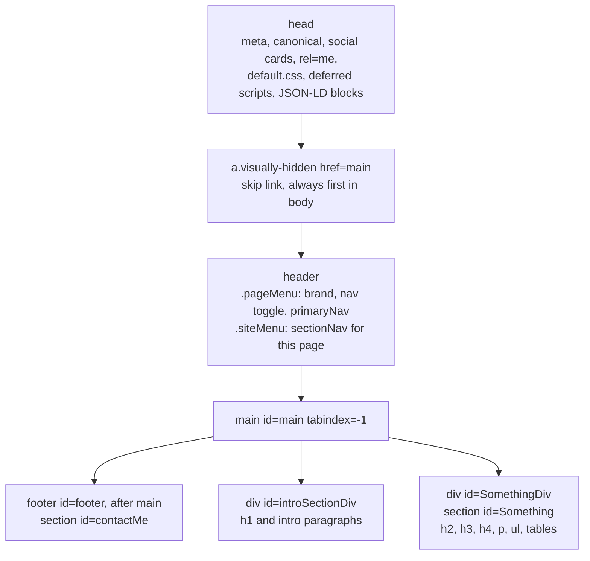

Anatomy decisions:

- **Each section is double-wrapped.** The outer `<div id="…Div">` is the **public anchor**: the section nav, the `Article` JSON-LD `url`, the `feed.xml` entry link, and the "Copy link" button all point at it. The inner `<section id="…">` is the **styling and animation hook**: the SCSS partials and the `*_animations.js` section maps target it.
- **The primary nav's current-page state is hard-coded** (`class="active" aria-current="page"`) on each page, so it exists at first paint and with scripting off. Only the section nav's "where am I" state is computed at runtime.
- **The header is duplicated on every page.** Adding or renaming a page means editing the nav on all seven.
- **The whole header is sticky, and it collapses at 1024 px.** Both nav rows sit inside one sticky `<header>`, so neither row can stick alone: a sticky element only sticks within its parent. To keep a zoomed desktop browser (about 960 CSS px wide at 200%) from pinning both rows across its viewport, the header collapses behind the toggle at `$nav_collapse_width` (1024 px) instead of the old 768 px. Collapsed, it is capped at `100dvh` and scrolls itself, because a sticky element taller than the viewport cannot otherwise be scrolled. `scroll-padding-top` reads the header's measured height from `--header-height`, which `navbar.js` sets.

---

## 5. Build and deployment

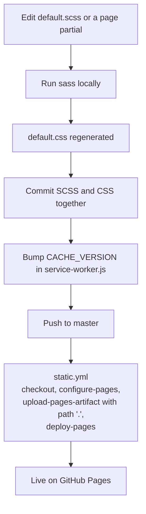

The only build step is compiling SCSS, run by hand:

```bash
sass --sourcemap=none --trace ./assets/css/default.scss ./assets/css/default.css
```

Deployment decisions:

- **CI builds nothing.** `.github/workflows/static.yml` uploads the repository root unchanged and deploys it. What is committed is exactly what is served, so forgetting to recompile ships stale CSS.
- **Triggers:** every push to `master`, plus manual `workflow_dispatch`.
- **Concurrency:** one group (`pages`) with `cancel-in-progress: false`, so a production deploy that has started always finishes.
- **The whole repository is public on the web.** Root Markdown files (including this one) and `assets/markdown/` are reachable by URL because the workflow publishes everything. `robots.txt` keeps `/assets/markdown/` out of search results, but that is a crawl directive, not access control.

---

## 6. Styling architecture

### Compilation graph

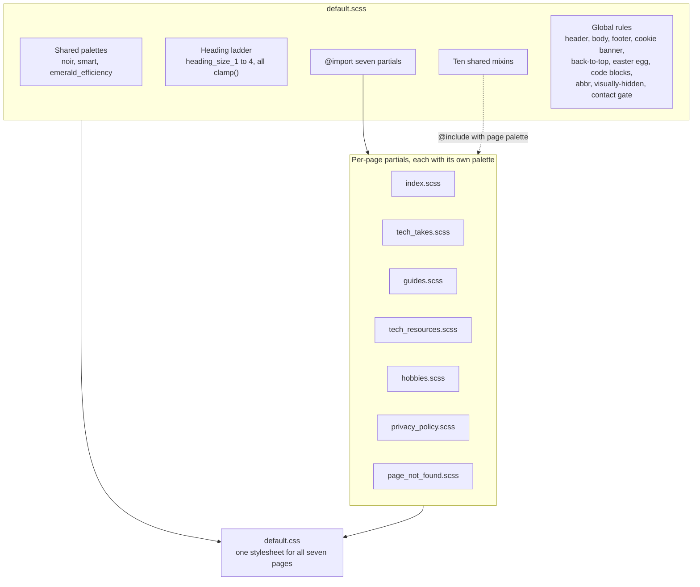

### How a partial is structured

Every partial follows the same pattern:

1. Declare a five-color palette (for example `$techno_serenity_1` to `$techno_serenity_5` in `guides.scss`).
2. Define a placeholder selector (`%guideSection`) that `@include`s the shared mixins with that palette.
3. `@extend` the placeholder onto each section ID (`#dataEngineeringGuide { @extend %guideSection; }`).
4. Call `animationGate` with the page's animated sections and the child selectors that start hidden.

Styles are therefore scoped by **section ID**, not by a page class on `<body>`. That is what lets one compiled stylesheet serve all seven pages without collisions.

### The mixin layer

Structural rules live in mixins so that a change (a border, spacing, a newly animated element type) is made once, not copied into seven partials. Only genuinely page-specific rules stay in a partial (the hobbies iframe and gallery, the tech-takes glossary, per-cell link colors).

| Mixin | index | tech_takes | guides | tech_resources | hobbies | privacy_policy | page_not_found |
| --- | :-: | :-: | :-: | :-: | :-: | :-: | :-: |
| `sectionShell` | ✓ | ✓ | ✓ | ✓ | ✓ | ✓ | ✓ |
| `headingRamp` | ✓ | ✓ | ✓ | ✓ | ✓ | ✓ | ✓ |
| `bodyText` | ✓ | ✓ | ✓ | ✓ | ✓ | ✓ | ✓ |
| `unorderedListText` | ✓ | ✓ | ✓ | ✓ | ✓ | ✓ | ✓ |
| `proseLinks` | ✓ | ✓ | ✓ | ✓ | ✓ | ✓ | ✓ |
| `animationGate` | ✓ | ✓ | ✓ | ✓ | ✓ |  | ✓ |
| `dataTable` | ✓ | ✓ | ✓ | ✓ | ✓ |  |  |
| `blockQuote` |  | ✓ | ✓ | ✓ | ✓ |  |  |
| `sectionPermalink` |  | ✓ | ✓ | ✓ |  |  |  |
| `orderedListText` |  | ✓ |  |  |  |  |  |

Notes on the gaps in that table:

- `privacy_policy.scss` omits `animationGate` because `privacy.html` loads no animation scripts. There is nothing to gate. Do not "fix" the omission.
- `sectionPermalink` is included exactly where `section_permalinks.js` is loaded.
- `orderedListText` is included once, inside `#VibeCodingScourge`, which holds the page's only `<ol>` content. Ordered and unordered list text are two separate mixins on purpose.
- `default.scss` makes one global `animationGate` call for `#contactMe`, the footer that appears on every page.

### Other styling decisions

- **Headings use `clamp()`.** The `$heading_size_1..4` ladder shrinks headings on narrow viewports and under zoom (WCAG 1.4.10 Reflow). The maximum of each clamp is the old fixed desktop size, so large screens look unchanged. Fixed percentage sizes must not come back.
- **WCAG AA contrast.** Every text and background pair in each palette is chosen for at least 4.5:1. The `/* */` contrast notes inside the partials are meant to ship in `default.css` next to the rule they justify. The `//` comments in the mixin block are silent and stay out of the compiled CSS.
- **Forced colors.** Windows High Contrast discards background tints, which would erase the section cards. `sectionShell` restores the boundary with `1px solid CanvasText` under `@media (forced-colors: active)`, and the header, footer, and permalink button have matching rules.
- **Reduced motion.** Smooth scrolling is enabled only under `prefers-reduced-motion: no-preference`, and `animationGate` forces gated content to `opacity: 1 !important` under `reduce`.
- **`abbr[title]`** gets a dotted underline and a help cursor, with no color. `text-decoration` draws in `currentColor`, so each section's already-compliant text color is inherited.
- **Shared rules for two pages.** `.feedSubscribe` and `#reading-progress` live unscoped in `tech_takes.scss` and are reused by `guides.html`. Both pages' intros sit on the same `$noir_2` body background, so the documented contrast holds on each.
- **Section typography** is `"Courier New", monospace`, set once in `sectionShell`.

---

## 7. JavaScript architecture

### 7.1 Loading model

All sixteen site scripts are **classic scripts with `defer`**, listed in each page's `<head>`. Deferred classic scripts run in document order after parsing finishes and before `DOMContentLoaded`. There are no ES modules of our own and no bundler.

AnimeJS is the one exception. Each animated page has:

```html
<script type="importmap">{"imports": {"animejs": "https://cdn.jsdelivr.net/npm/animejs@4.3.5/+esm"}}</script>
<script type="module" async>import * as anime from 'animejs'; window.anime = anime;</script>
```

The module shim is `async` **on purpose**. A parser-inserted module script without `async` joins the same in-order queue as the deferred scripts, so a slow or blocked CDN would hold up `navbar.js` and everything else that does not need AnimeJS. With `async`, the module races the deferred scripts instead, and every consumer reads `window.anime` at call time rather than at load time.

A typical page load (here `tech_takes.html`):

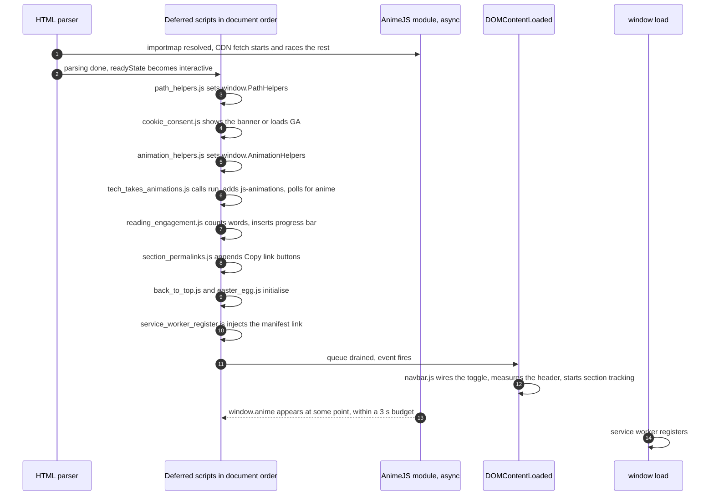

Most scripts guard their start-up with `if (document.readyState === "loading") { wait for DOMContentLoaded } else { init() }`. Because the document is already `interactive` when deferred scripts execute, that check falls through and `init()` runs immediately, in document order. `navbar.js` is the only script that unconditionally waits for `DOMContentLoaded`.

### 7.2 Shared globals

Scripts communicate through a small, fixed set of globals:

| Global | Defined by | Consumed by |
| --- | --- | --- |
| `window.PathHelpers` `{ isNested, rootPrefix, toRoot }` | `path_helpers.js` | `cookie_consent.js`, `service_worker_register.js`, and optionally `section_permalinks.js` |
| `window.AnimationHelpers` `{ directChildren, addStep, introTimeline, animateIntro, animateContact, prefersReducedMotion, run }` | `animation_helpers.js` | Every `*_animations.js` |
| `window.anime` | The inline module shim | `animation_helpers.js`, `*_animations.js`, optionally `back_to_top.js` |
| `window.cookieConsent` `{ accept, reject, revoke }` | `cookie_consent.js` | Public API; the privacy page's buttons reach the same actions through `data-cookie-consent` attributes |
| `window.dataLayer`, `window.gtag` | `cookie_consent.js`, only after consent | Google's `gtag.js` |

Every consumer checks for the global it needs and **bails silently** if it is missing. That keeps a missing file from breaking the page, but it also means a missing or misordered tag produces no console error.

### 7.3 Which page loads what

| Script | index | tech_takes | guides | tech_resources | hobbies | privacy | 404 |
| --- | :-: | :-: | :-: | :-: | :-: | :-: | :-: |
| `path_helpers.js` | ✓ | ✓ | ✓ | ✓ | ✓ | ✓ |  |
| `cookie_consent.js` | ✓ | ✓ | ✓ | ✓ | ✓ | ✓ |  |
| AnimeJS shim + `animation_helpers.js` | ✓ | ✓ | ✓ | ✓ | ✓ |  | ✓ |
| `<page>_animations.js` | ✓ | ✓ | ✓ | ✓ | ✓ |  | ✓ |
| `reading_engagement.js` |  | ✓ | ✓ |  |  |  |  |
| `section_permalinks.js` |  | ✓ | ✓ | ✓ |  |  |  |
| `photo_gallery.js` |  |  |  |  | ✓ |  |  |
| `navbar.js` | ✓ | ✓ | ✓ | ✓ | ✓ | ✓ | ✓ |
| `back_to_top.js` | ✓ | ✓ | ✓ | ✓ | ✓ | ✓ | ✓ |
| `easter_egg.js` | ✓ | ✓ | ✓ | ✓ | ✓ | ✓ | ✓ |
| `service_worker_register.js` | ✓ | ✓ | ✓ | ✓ | ✓ | ✓ |  |

Two deliberate exceptions:

- **`privacy.html` loads no AnimeJS and no animation scripts.** It is a disclosure page and should render immediately and plainly.
- **`404.html` omits `path_helpers.js`, `cookie_consent.js`, and `service_worker_register.js`.** GitHub Pages serves its content at arbitrary missing URLs, where path-derived logic cannot know the real depth (see [section 8](#8-paths-origins-and-the-404-page)). It loads no analytics, so it needs no consent banner.

`navbar.js`, `back_to_top.js`, and `easter_egg.js` derive no paths and depend on nothing, which is why they are safe on all seven pages.

Every file in `assets/js/` is loaded by at least one page and listed in `PRECACHE_URLS`. A script that no page loads is deleted rather than left precached.

### 7.4 Ordering contracts

The order of `<script>` tags in each `<head>` carries meaning. A comment above each `path_helpers.js` tag, and above each `section_permalinks.js` tag, states the rule for that tag. This list and AGENTS.md give the full reasoning.

1. **`path_helpers.js` must come before `cookie_consent.js`** (and therefore before `service_worker_register.js`). If it runs late or not at all, the consent banner renders without its privacy-policy link, the manifest link is never injected, and the service worker never registers. None of these produce an error.
2. **`animation_helpers.js` must come before every `*_animations.js`.** The page script checks for `window.AnimationHelpers` and returns if it is absent. Content then stays fully visible because the gate class is never added.
3. **`reading_engagement.js` must come before `section_permalinks.js`** on `tech_takes.html` and `guides.html`. Reading time is computed from each section's word count, and the "Copy link" button's text would otherwise be counted. Both scripts run their `init()` during the deferred pass, so document order decides which goes first. `tech_resources.html` has no reading-time script and carries no such constraint.
4. **The AnimeJS module is unordered on purpose.** Nothing may assume it has loaded; see 7.1.

### 7.5 Animation subsystem

Each animated page supplies a **section map** (`{ key: "#selector" }`) and an **animation map** (`{ key: fn(el) }`), then hands both to `AnimationHelpers.run`. Shared intro and footer animations live in `animation_helpers.js`. Each content section gets its own entrance style that matches its topic. On `tech_takes.html`, for example, the cryptocurrency section flickers in and the physical-media section lands like a record dropped on a turntable.

The JavaScript half:

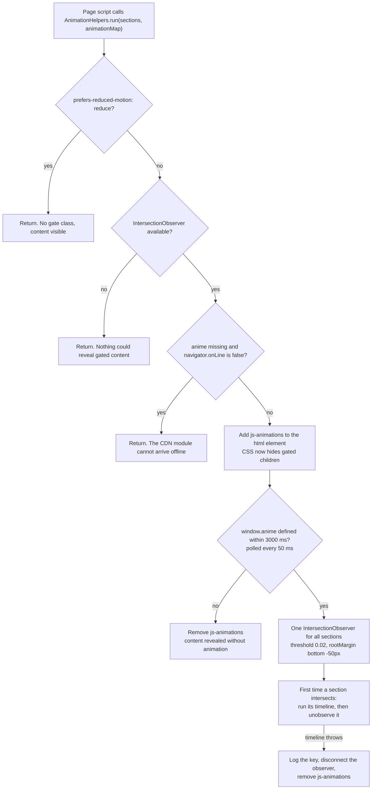

The CSS half is the `animationGate($sections, $children)` mixin:

```scss
html.js-animations {  #{$sections} { #{$children} { opacity: 0; } } }
@media (prefers-reduced-motion: reduce) {
    html.js-animations { #{$sections} { #{$children} { opacity: 1 !important; } } }
}
```

Animation decisions:

- **Content is hidden only when a script has committed to revealing it.** The CSS gate keys off a class that only `run()` adds, so visitors with JavaScript off, a failed script, or a blocked CDN always see the page. Every path that ends without animating leaves the class off or removes it.
- **The gate goes on immediately, not after AnimeJS arrives.** First paint usually happens before a cold CDN fetch resolves. Gating late would show content, snap it invisible, then animate it back in.
- **A bounded wait.** An earlier version checked for `window.anime` once and gave up permanently when the CDN was slow. The current version polls for up to three seconds, then reveals.
- **A failing animation reveals the page.** A section is marked animated and unobserved before its timeline runs, so a throw used to strand it at `opacity: 0`. The observer now catches the error, logs `[animations] <key> failed`, stops observing, and removes the gate. Remaining sections then show without animation, the same outcome as a CDN that never arrives.
- **Single-shot.** Each section animates the first time it scrolls into view and never replays.
- **Direct children only.** `directChildren()` and the gate's `> h2, > p, …` selectors match each other, so nested elements are not tweened twice. `addStep()` skips empty target lists so AnimeJS never warns about missing targets.
- **Reduced motion is checked per call**, not cached at load, so toggling the OS setting mid-session is honored.

### 7.6 Consent and analytics

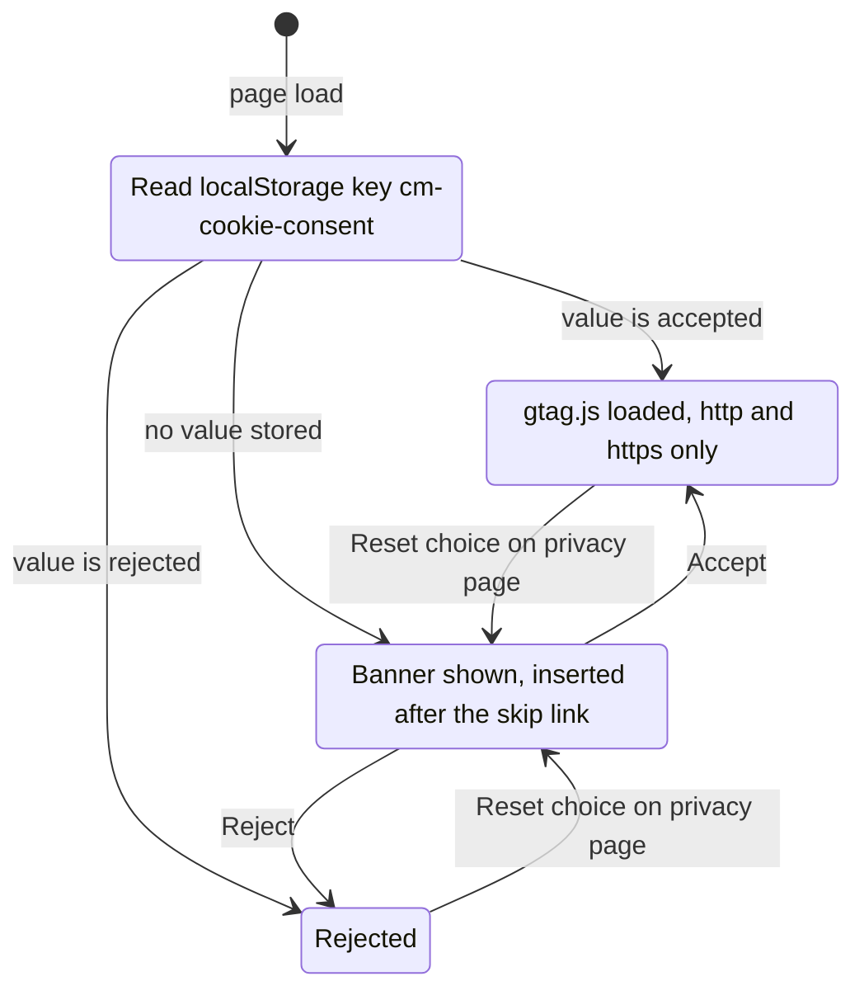

Consent decisions:

- **Google Analytics never loads before consent.** No `gtag.js` request and no GA cookies until the visitor clicks Accept. On `file://`, analytics never loads at all.
- **The banner is a non-modal `role="dialog"`** labelled by its own message (`aria-labelledby`). An earlier `role="region"` with `aria-live` never announced, because a live region only reports changes inside a region that already exists.
- **It is inserted right after the skip link**, making the consent choice the second tab stop rather than the last, behind every link on the site's longest pages (WCAG 2.4.3). CSS pins it to the bottom of the viewport, so DOM position does not affect where it draws. Do not change it back to `document.body.appendChild`.
- **Focus is not moved into it.** Pulling focus on page load is more disruptive than the ordering problem it would solve.
- **Reject is placed before Accept** in both the DOM and the visual order, so neither choice is buried.
- **The DOM is built with `createElement` and text nodes**, never `innerHTML`, so no markup is parsed from interpolated values.
- **Storage failures are tolerated.** In private modes where `localStorage` throws, the banner still works; the choice just does not persist.
- **The privacy page carries static controls**: three buttons with `data-cookie-consent="accept|reject|revoke"` and a `#cookieConsentStatus` `role="status"` paragraph that reports the current choice. `onChoice()` and `revoke()` refresh that paragraph themselves, so a choice made in the banner or through `window.cookieConsent` is announced too, not only one made with the privacy-page buttons.
- **The banner never hides focus.** It is drawn over the bottom of the viewport, which is exactly where a browser stops when it scrolls a newly focused element into view. While it is visible, `html:has(.cookieConsent.visible)` sets `scroll-padding-bottom` to its height (WCAG 2.4.11). The script measures that height with a `ResizeObserver` and publishes it as `--cookie-banner-height`, because the message wraps to a different number of lines at each width. The CSS carries fixed fallbacks.
- **Scope is deliberate.** This is a lightweight, dependency-free banner sized for the GDPR and CCPA exposure of GA4 on a personal site, not an IAB TCF consent-management platform.

### 7.7 Service worker and PWA

`service_worker_register.js` does two things, both only over `http(s)` and only when `window.PathHelpers` exists:

1. Injects `<link rel="manifest">` pointing at the root `manifest.json`. Browsers block manifest fetches from `file://` through CORS, so the link is **never** hardcoded in HTML.
2. Registers `service-worker.js` on `window` `load`, and logs a warning if registration fails.

Worker lifecycle:

- **install:** open `colbymainard-<CACHE_VERSION>` and `cache.add()` each entry of `PRECACHE_URLS` individually. A failed entry logs a warning instead of failing the whole install, so one bad path cannot take offline support down. Then `skipWaiting()`.
- **activate:** delete every other cache whose name starts with `colbymainard-`, then `clients.claim()`.

Request handling:

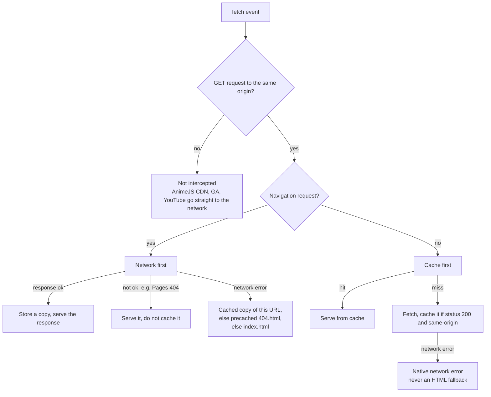

Service worker decisions:

- **Pages are network-first, sub-resources are cache-first.** Online visitors always see the latest HTML. CSS, JS, images, and text files come from the cache, which is why **any change to a precached file needs a `CACHE_VERSION` bump**; without one, returning visitors keep stale copies.
- **Only successful navigations are cached**, so mistyped URLs don't store copies of the 404 page.
- **The offline fallback is `404.html`, not the home page.** Telling the visitor the page isn't available is more honest than silently substituting the landing page.
- **Sub-resource failures never receive HTML.** Returning a page to a request that expected CSS or JS would cause confusing downstream errors.
- **Large media is excluded from precache.** The five `photographyHobby/` originals (3.5 to 5.0 MB each) and `miscellaneous/DEFCON33.jpeg` (2.1 MB) would add about 22 MB to every first visit, including visitors who never open `hobbies.html`. The fetch handler still caches each one the first time it is actually viewed.
- **Cross-origin requests pass through untouched.** A side effect is that AnimeJS is never cached, so offline visits skip animations (see 7.5).
- **Manifest:** `display: standalone`, black background and theme color, `start_url: "."`, and a single 256×256 PNG icon.

### 7.8 Page helpers

| Script | Pages | What it does | Key decisions |
| --- | --- | --- | --- |
| `navbar.js` | All | Collapsed-nav toggle (`aria-expanded`; Escape closes and returns focus; following a menu link closes it without moving focus). Publishes the closed header's height as `--header-height` for `scroll-padding-top`. Tracks the section in view and sets `aria-current="location"` on the matching `#sectionNav` link. | Primary nav state is markup, not script. Header measurements taken while the collapsed menu is open are skipped, so a link tapped in the open menu scrolls against the closed height. Section tracking uses an `IntersectionObserver` band across the upper third of the viewport (`rootMargin: -25% 0px -65% 0px`) so tall sections don't stay marked all the way down. The marker holds its last value between sections instead of blanking. |
| `back_to_top.js` | All | Floating button that appears after 400 px of scroll and returns to the top. | Uses AnimeJS when present and native smooth scroll otherwise. Instant under reduced motion. Moves focus to the first primary-nav link (or `main`) after scrolling. Interrupted fades resume from their live opacity. |
| `easter_egg.js` | All | Konami code reveals a small card with a rotating developer joke. | Rolling-window key matching handles stuttered input. `role="note"`, not a dialog. It is the one script that moves focus on reveal, because the visitor asked for it with a ten-key sequence, and focus is restored on close. Ignores keystrokes in form fields. |
| `reading_engagement.js` | tech_takes, guides | Fills each `[data-reading-time]` placeholder with "N min read" at 200 words per minute, and adds a top-of-viewport progress bar. | The progress bar is `aria-hidden` because it duplicates the scrollbar. The `·` separator is inserted by script so a no-JS page shows no dangling punctuation. Scroll updates are batched with `requestAnimationFrame`. |
| `section_permalinks.js` | tech_takes, guides, tech_resources | Appends one centered "Copy link" button as the last child of each section card. | See below. |
| `photo_gallery.js` | hobbies | Turns the stacked photograph list into a one-at-a-time viewer with Previous/Next and arrow keys. | Gated behind a `.js-gallery` class; with scripting off, all five photos render stacked and the controls stay `hidden`. **Never auto-advances** (WCAG 2.2.2). Never moves focus. Carousel roles are added only once the viewer is active. Showing one slide at a time means inactive `loading="lazy"` images are not fetched. |

`section_permalinks.js` in more detail, since it resolves anchors in a non-obvious way:

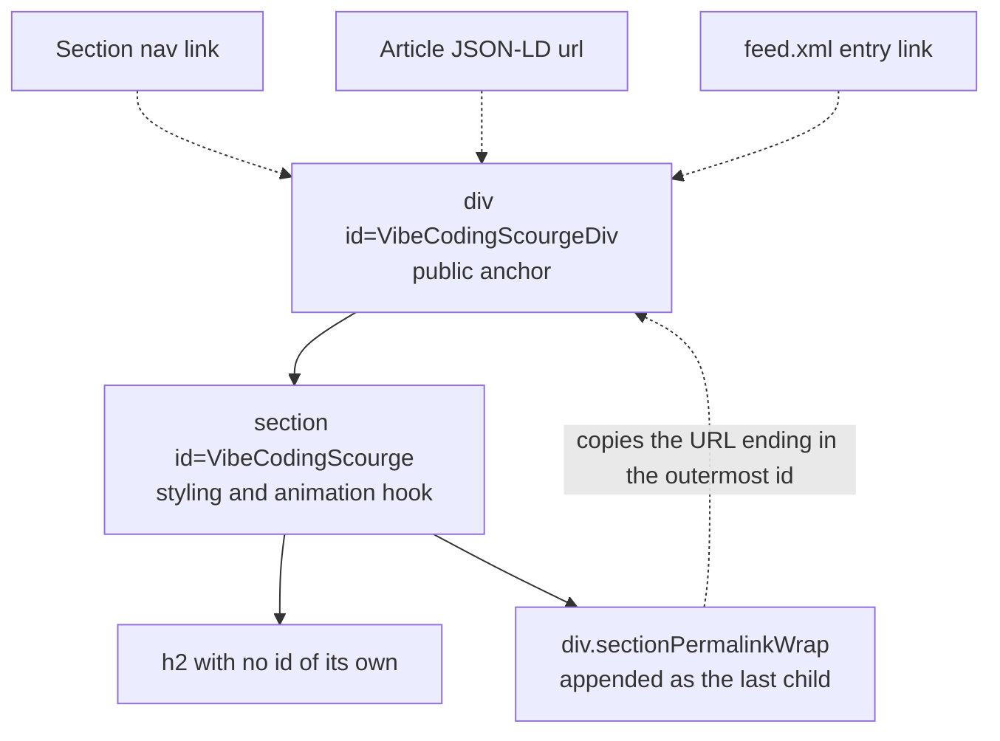

- **One button per card, driven by `h2` only.** Deeper headings would produce a second button at the foot of the same card copying a different anchor, with nothing to tell them apart.
- **The anchor is the outermost ancestor id below `<main>`**, not the nearest. That keeps the copied URL identical to the one the section nav, JSON-LD, and feed already publish.
- **Accessible name is "Copy link" plus a visually hidden " to <heading>"**, so the name starts with the visible words (WCAG 2.5.3 Label in Name) and every button is distinguishable in a screen reader's element list.
- **It works from `file://`.** Off `http(s)`, the button copies the canonical published URL (`https://colbymainard.github.io/...`) rather than a local path nobody else can open. Because the Clipboard API requires a secure context, those copies use the `execCommand("copy")` fallback.
- **Announcements go through a static `#sectionPermalinkStatus` `role="status"` paragraph** in the page's markup. If the copy fails, the announcement includes the URL itself, so the reader is never left at a dead end.
- An earlier version placed the button inline inside each heading. It moved to the end of the card on 2026-09-06, which is where a reader who has just finished the section is.

---

## 8. Paths, origins, and the 404 page

### Relative paths everywhere

Every internal URL is relative (`./assets/...` at the root, `../css/...` and `../../feed.xml` from `assets/html/`). A leading-slash path would resolve to the filesystem root when the site is opened as plain files, so root-absolute paths are avoided.

Scripts that must build a root-relative URL at runtime all ask `path_helpers.js`:

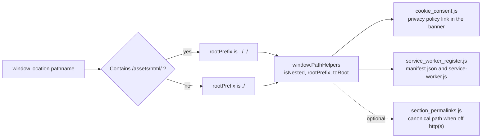

Before this helper existed, each consumer tested for `/assets/html/` itself, so moving a page meant two hand edits kept in lockstep, and missing one silently broke either the banner link or service worker registration.

### Behavior by origin

| Feature | Served over `https://` | Opened from `file://` |
| --- | --- | --- |
| Pages, CSS, images, internal links | Work | Work (all paths relative) |
| Manifest link | Injected at runtime | Not injected (CORS) |
| Service worker | Registered | Not registered |
| Google Analytics | Loads after consent | Never loads |
| Consent banner | Shown until a choice is stored | Shown until a choice is stored |
| "Copy link" buttons | Copy the current URL via the Clipboard API | Copy the canonical `https://` URL via `execCommand` |

### The 404 page

GitHub Pages answers any missing URL by serving the **content** of `404.html` at that URL, with status 404. The page's relative paths then resolve against whatever directory the visitor requested.

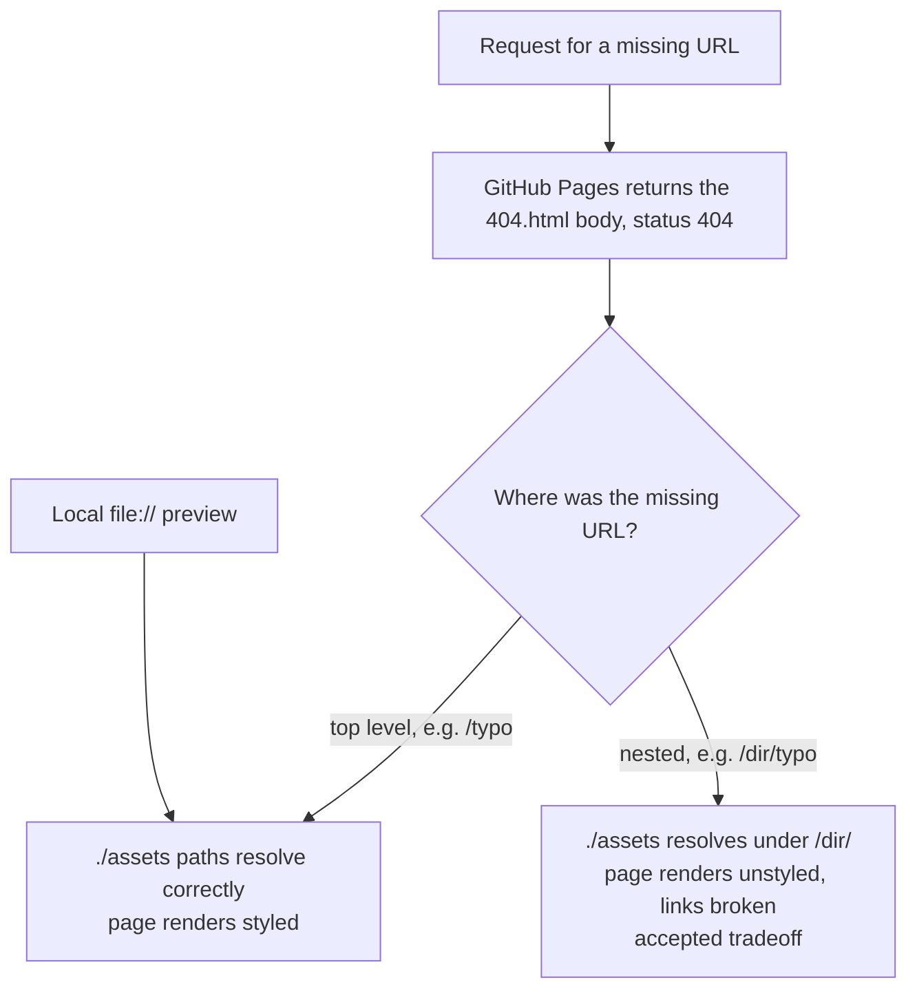

404 decisions:

- **Relative paths, like every other page.** Root-absolute paths would fix nested missing URLs but break `file://` previews. The site chose `file://` support and accepts the unstyled nested case. Do not convert it back without being asked.
- **The few root-absolute exceptions** are the favicon and apple-touch-icon links and the footer's PGP key and Privacy Policy links.
- **No path-dependent scripts.** It omits `path_helpers.js`, `cookie_consent.js`, and `service_worker_register.js` because their depth logic cannot know where the page is really being served. The service worker still controls it once registered from any other page.
- **No canonical link.** There is no single URL a canonical could honestly name. It is `noindex, follow`, and excluded from the sitemap.

---

## 9. SEO, structured data, and discovery

### One Person entity across the site

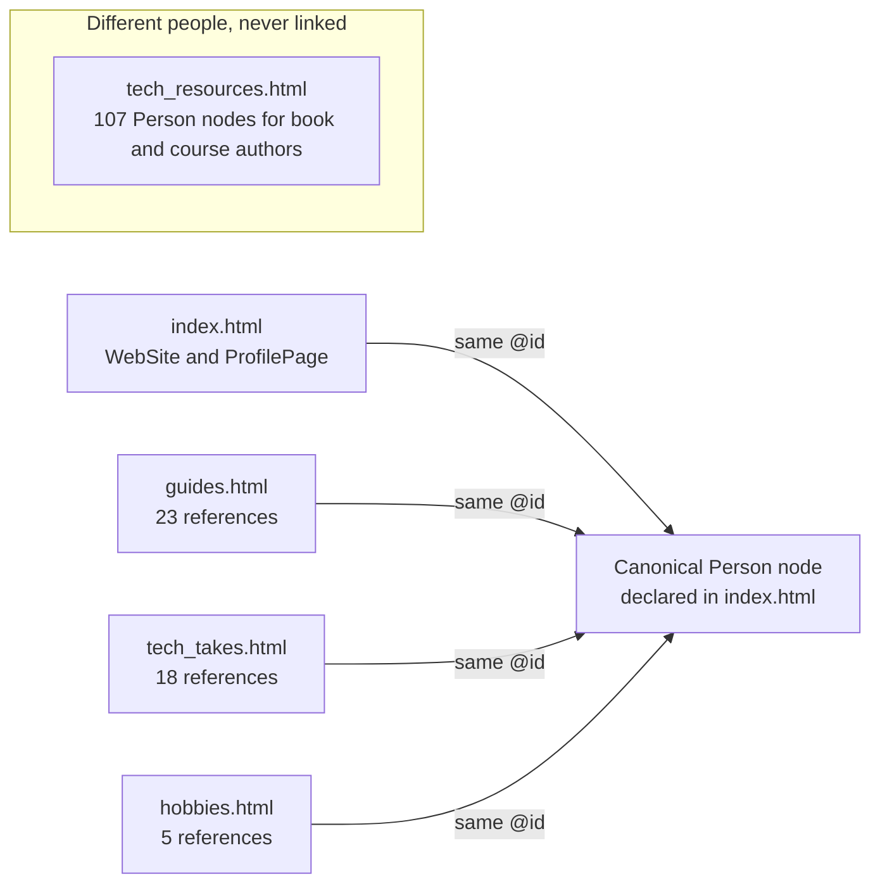

`index.html` declares the canonical `Person` with `"@id": "https://colbymainard.github.io/#person"`. Every `author`, `publisher`, or `creator` node that represents Colby elsewhere (46 across `guides.html`, `tech_takes.html`, and `hobbies.html`) repeats that `@id` **alongside** `@type` and `name`. The `@id` lets crawlers merge the nodes into one entity instead of inventing an anonymous person per page. The `name` stays because Google validates `author.name` per page, and a node holding only an `@id` fails on pages that don't define the entity locally. The authors in `tech_resources.html` are other people and must never carry this `@id`.

### Discovery surfaces

| Surface | What it contains | Design decision |
| --- | --- | --- |
| JSON-LD | One or more `<script type="application/ld+json">` blocks in every page's `<head>` (see the table in [section 4](#4-pages-and-page-anatomy)) | Extend, never remove. `tech_resources.html` models every book, podcast, and certification so the lists are machine-readable. |
| `sitemap.xml` | The five indexable pages with `<lastmod>` | `privacy.html` and `404.html` are `noindex`, and listing a `noindex` URL in a sitemap contradicts itself ("Submitted URL marked 'noindex'"). Their absence is correct. |
| `robots.txt` | Three groups: 89 training and scraping user agents blocked; 10 live-search, AI-assistant, and link-preview agents allowed; everyone else allowed. Sitemap declared. | Training bots give the site nothing back. Live-search and assistant bots answer real user queries, where recruiters and enthusiasts increasingly start. `Disallow: /assets/markdown/` is repeated in every allowing group because robots.txt groups do not inherit from each other. |
| `llms.txt` | Plain-text summary for LLMs: key facts, FAQ, page list, guide and resource sections, citation policy, and a `Last updated` line | Tells assistants to say the site does not cover something rather than guess, and to avoid confusing Colby with others who share the name. Its `Last updated` line is the one date nothing else reminds you to move. |
| `feed.xml` | Atom feed, 15 entries (8 stances and 7 guides), newest first | Hand-maintained. Entry `<id>`s are permanent `tag:` URIs, so renaming an anchor changes only `<link href>`. Linked from the `<head>` of `tech_takes.html` and `guides.html` (with a different `title` on each), plus a visible "Subscribe (Atom)" link in each page's intro. No other page links it. |
| Canonical links | Self-referencing on the six non-404 pages | `privacy.html` keeps its canonical alongside `noindex`, which search engines handle correctly. |
| Social cards | Open Graph, Twitter, and LinkedIn tags on every page, all using `assets/images/sharecard.png` (1200×630) | One consistent preview wherever a link is shared. `index.html` uses `og:type` `profile` to agree with its `ProfilePage` JSON-LD. |
| `rel="me"` | GitHub and LinkedIn profile links | Asserts the site and profiles belong to the same person; matches the `Person` `sameAs`. |
| Verification meta | Google and Bing site-verification tags on `index.html` | Search Console and Webmaster Tools ownership. |

---

## 10. Accessibility architecture

Accessibility is built into shared structure rather than patched per page.

- **Skip link first.** Every page opens `<body>` with `<a href="#main" class="visually-hidden">Skip to main content</a>`. It is intentionally screen-reader-only and stays hidden on focus. `main#main` has `tabindex="-1"` so it can receive focus.
- **Injected UI respects that order.** Anything a script inserts near the top of `<body>` (the consent banner, the reading progress bar) goes **after** the skip link. UI with no ordering concern (back-to-top button, easter-egg card) is appended at the end.
- **Live regions live in the static markup.** `#photoGalleryStatus`, `#sectionPermalinkStatus`, and `#cookieConsentStatus` exist before any script runs, because assistive technology only announces changes inside a region that already existed.
- **Focus is not taken without a reason.** No script moves focus on page load or during gallery or permalink interactions. The exceptions are all responses to an explicit action: back-to-top focuses the top of the page after scrolling there, Escape in the mobile nav returns focus to the toggle, and the easter egg focuses the card it reveals and restores focus when closed.
- **Reduced motion is honored in four places:** the CSS gate, `AnimationHelpers.run`, `back_to_top.js`, and `easter_egg.js`, each checking at the moment of use. Smooth scrolling is enabled only under `no-preference`.
- **Forced colors** restore card boundaries, header and footer bands, and the permalink button border.
- **Reflow:** headings use `clamp()`, and every data table sits in a `.tableScroll` container so it scrolls on its own instead of widening the page.
- **Abbreviations:** 71 `<abbr title="…">` elements across six pages (guides 23, tech_takes 22, privacy 9, index 8, tech_resources 8, hobbies 1), marked on first use in each section. The dotted underline is a visual cue, but `title` is not reachable by keyboard or touch, so terms that matter are also spelled out in prose.
- **Tables** carry a visually hidden `<caption>` and `scope`d `<th>` cells.
- **SVGs:** decorative ones are `aria-hidden="true"`; new inline SVGs use `role="img"` with a `<title>`.
- **Navigation state:** `aria-current="page"` on the primary nav (in the markup) and `aria-current="location"` on the section nav (set by `navbar.js`).
- **Motion that the user controls:** the gallery never auto-advances, so there is no WCAG 2.2.2 pause obligation to meet.

---

## 11. Content model and maintenance workflows

All content is written directly in the HTML. There is no CMS, no templating, and no generator, which keeps the site trivially static and inspectable. The cost is that one fact often appears in several files, and nothing checks that they agree.

What has to move when a Technical Stance or Guide is added or edited:

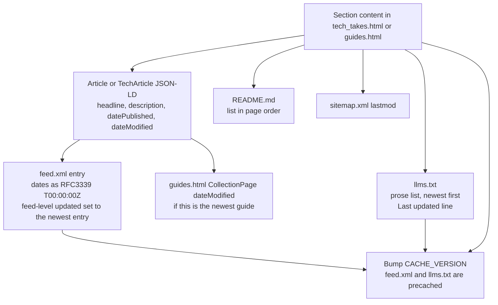

Other recurring workflows, with the full checklists in [AGENTS.md](AGENTS.md#task-checklists):

- **Style change:** edit SCSS, recompile, commit `default.css` with it, re-check contrast for any touched pair, bump `CACHE_VERSION`.
- **New page:** copy an existing `<head>` and header, add it to the nav on every page, create and `@import` its partial, register it in `sitemap.xml` (if indexable), `llms.txt`, and `PRECACHE_URLS`, bump `CACHE_VERSION`.
- **New script or asset:** load it from a page, add it to `PRECACHE_URLS` (unless it is multi-megabyte media), bump `CACHE_VERSION`.
- **New acronym:** wrap first use per section in `<abbr title="…">`.
- **New `Person` node for Colby:** copy an adjacent node so it carries the canonical `@id` and `name`.

---

## 12. Supporting material in the repository

| Path | Purpose |
| --- | --- |
| `AGENTS.md`, `CLAUDE.md` | Rules and checklists for AI coding agents working on the site. |
| `.claude/agents/website_code_reviewer.md` | A read-only reviewer agent (Read, Glob, Grep) for HTML, SCSS, and JS quality, accessibility, and convention checks. |
| `.claude/skills/` | Seven strategy skills: accessibility audit, backlink strategy, content polishing, feature recommendations, roadmap generation, SEO, and web authority. They produce reports rather than code changes. |
| `assets/markdown/` | Where those reports land, named `<topic>-YYYY-MM-DD.md`. Reports are **disposable**: they are deleted once acted on, and the site plus the Known gaps lists in AGENTS.md and CLAUDE.md become the record. Two undated reference documents stay permanently: `animations_report.md` and this file, `architecture.md`. |
| `press_mentions.csv` | Log of external articles that quote Colby (`Link,Author,Comments`). |
| `assets/other/pgp_email_key.asc` | Public PGP key linked from every footer. |

---

## 13. Known gaps and accepted tradeoffs

**Open defects** (bugs to fix, not patterns to copy):

- **About 22 MB of unoptimized imagery.** The five `photographyHobby/` originals and `DEFCON33.jpeg` are camera originals. `DEFCON33.jpeg` is the Largest Contentful Paint element on `hobbies.html` and carries `loading="lazy"`, which delays the paint it is measured on. Shrinking these images would also remove the need for the precache exception.

**Accepted tradeoffs** (known and chosen):

| Tradeoff | Why it was accepted |
| --- | --- |
| `404.html` renders unstyled at nested missing URLs | Keeps it working from `file://` and at top-level missing URLs, which are the common cases. |
| No animations when offline | AnimeJS is cross-origin and never cached. Content still renders fully; only motion is lost. |
| `abbr` expansions unreachable by keyboard and touch | `abbr` is not focusable. Important terms are spelled out in prose instead. |
| Internal docs are publicly reachable | The deploy publishes the whole repository. `robots.txt` keeps `assets/markdown/` out of search, but nothing there should be secret. |
| Duplicated facts with no automated check | Feed, `llms.txt`, README lists, sitemap dates, and the header nav are hand-synced. Adding a generator would add the build step and dependencies the site avoids. |
| Lightweight consent banner, not a full CMP | Proportionate to one analytics tag on a personal site. |

---

## 14. Decision record

A consolidated list of the decisions described above, for quick reference.

| # | Decision | Rationale | Where it lives |
| --- | --- | --- | --- |
| 1 | Static files on GitHub Pages, no backend | Simplest reliable hosting for a personal site, with no server to maintain | `.github/workflows/static.yml` |
| 2 | CI publishes the repo as-is; compiled CSS is committed | No build infrastructure; what is committed is what is served | `static.yml`, `assets/css/default.css` |
| 3 | Support `file://` as a first-class origin | Local previews must match production | Relative paths throughout, `path_helpers.js` |
| 4 | One path-depth helper shared by all path-aware scripts | Previously duplicated logic drifted and failed silently | `assets/js/path_helpers.js` |
| 5 | AnimeJS is the only dependency, via importmap and an async module shim | Minimal load time; a slow CDN must not block other scripts | Each animated page's `<head>` |
| 6 | Classic deferred scripts sharing a few globals | No bundler needed; document order is the dependency graph | `assets/js/`, each `<head>` |
| 7 | Content is hidden for animation only after a script opts in | No-JS, failed-JS, and blocked-CDN visitors always see content | `animationGate` mixin, `AnimationHelpers.run` |
| 8 | Bounded 3-second wait for AnimeJS | A one-shot check permanently disabled animations on slow loads | `animation_helpers.js` |
| 9 | One compiled stylesheet, per-page partials scoped by section ID | One cached file for the whole site without selector collisions | `default.scss` and partials |
| 10 | Shared structure lives in ten mixins | A structural change is made once, not seven times | `default.scss` |
| 11 | `clamp()` heading ladder | WCAG 1.4.10 Reflow without changing desktop sizes | `$heading_size_1..4` |
| 12 | GA is loaded only after consent, never on `file://` | Privacy by default; GDPR and CCPA exposure | `cookie_consent.js` |
| 13 | Consent banner is a non-modal dialog placed after the skip link, without focus capture | Second tab stop (WCAG 2.4.3) without hijacking focus | `cookie_consent.js` |
| 13a | Scroll padding reserves the banner's and the header's measured heights | Focus and anchor targets never land behind fixed or sticky UI (WCAG 2.4.11) | `default.scss`, `cookie_consent.js`, `navbar.js` |
| 14 | Pages network-first, assets cache-first, versioned cache | Fresh HTML online, fast repeat visits, explicit invalidation | `service-worker.js` |
| 15 | Offline fallback is `404.html` | Honest about what is unavailable | `service-worker.js` |
| 16 | Multi-megabyte photos are not precached | Avoids a 22 MB background download on every first visit | `service-worker.js` comment |
| 17 | Manifest link injected at runtime over http(s) only | Browsers block manifest fetches from `file://` | `service_worker_register.js` |
| 18 | `404.html` uses relative paths and omits path-aware scripts | Works locally and at top-level missing URLs; nested URLs are an accepted loss | `404.html` head comments |
| 19 | One `Person` entity with a shared `@id` and `name` | Crawlers merge the author graph instead of fragmenting it | JSON-LD on index, guides, tech_takes, hobbies |
| 20 | `noindex` pages are excluded from the sitemap | A sitemap listing `noindex` URLs contradicts itself | `sitemap.xml` |
| 21 | Block training bots, allow live-search and assistant bots | Visibility where the audience searches, no free training data | `robots.txt` |
| 22 | Hand-maintained Atom feed with permanent `tag:` IDs | Subscribers never see duplicate entries after an anchor rename | `feed.xml` |
| 23 | Double-wrapped sections: outer div is the public anchor | One stable URL per section across nav, JSON-LD, feed, and share buttons | Page markup, `section_permalinks.js` |
| 24 | Primary-nav current state is in the markup | Correct at first paint and with scripting off | Each page's `#primaryNav` |
| 25 | Live regions are static markup | Injected regions don't announce their first change | `#photoGalleryStatus`, `#sectionPermalinkStatus`, `#cookieConsentStatus` |
| 26 | Photo gallery is manual only | Avoids WCAG 2.2.2 obligations and respects slow readers | `photo_gallery.js` |
| 27 | `abbr[title]` is styled with a dotted underline and no color | Visual cue that inherits each section's compliant text color | `default.scss` |
| 28 | Every script in `assets/js/` must be loaded somewhere | Unreferenced scripts waste precache space and confuse readers | `PRECACHE_URLS`, page heads |
| 29 | Strategy reports are disposable | The site and the Known gaps lists are the long-term record | `assets/markdown/` |
